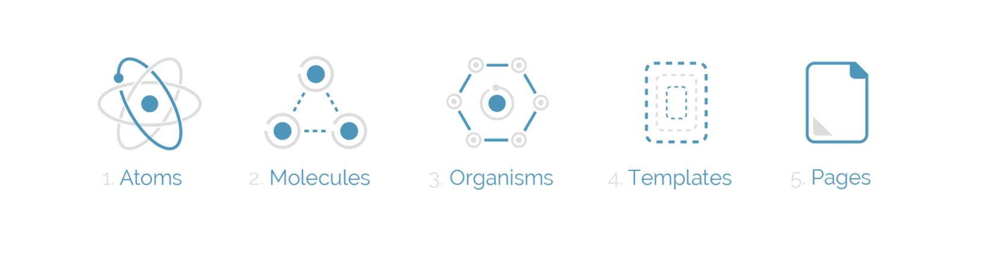
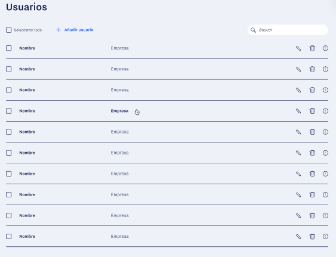
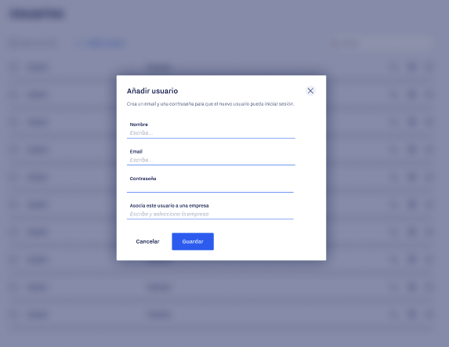

# Resumen

Hemos dividio la charla en dos días, el primero hablamos de **Atomic Design**, la importancia de separar cada componente dependiendo de su utilidad.

Los podemos separar en:
1. Atoms.
2. Molecules.
3. Organisms.
4. Templates.
5. Pages.

Y con todo esto también explicamos lo más fundamental de [Styled components](https://styled-components.com/).

Lo siguiente que vimos fueron los componentes funcionales y los Hooks. 

1. UseState
2. UseEffect
3. UseRef

Además de crear un Hook personalizado nosotros mismos que contiene su propio estado.

Por último explicamos de forma sencilla Context, que recordamos que tiene dos partes:
El **Provider** y el **Consumer**.

# Ejercicio

El ejercico constará de utilizar todo lo que hemos visto. 
Tendremos que poder añadir usuarios a una lista que se reflejará en otra página, os dejo unas imágenes de ejemplo pero son solo para que podáis sacar toda la estructura.

- Para ello es obligatorio el uso de la estructura **Atomic**, con ello el uso de todas sus partes.
- Solo se podrá utilizar componentes funcionales.
- Para manejar los diferentes estados será necesarío utilizar Hooks.
- Se tiene configurar un hook personalizado (de libre elección). 
- Se tiene que crear un Context, al igual que el hook personalizado es de libre elección.

La función del ejercicio:

1. Podremos crear usuarios con Correo Electrónico que deberá de validarse y una contraseña de mínimo 6 caracteres, minimo 1 mayuscula, 1 minuscula y un número. Además de tener un nombre de empresa (Las validaciónes serían una buena forma de utilizar un hook personalizado).
3. Tendremos que hacer una llamada a una api que nos devuelva una lista de usuarios, podemos utilizar una api propia o directamente esta api https://reqres.in/, la llamada para optener la lista sería https://reqres.in/api/users?page=1.
4. A su vez tendremos que poder eliminar un usuario de la lista dando a la papelera que tiene a la derecha.

**Optativo**

- Utilizar un Hook que no se haya mencionado en la charla.
- El buscador podrá buscar por nombre y empresa.
- Crear vustra propia API para esta funcionalidad (el Back también lo revisaré).
- Poder editar un usuario. (Reutilizar el mismo componente que añadir usuario pero haciendo referencia a uno).
- Si miráis la documentación de Styled Components podemos utilizar algo que se llama `theme` que se utiliza para poder crear variables para que las utilicen los styled que podrían ayudar.

### Modo de entrega.

Podréis hacer PR a este mismo proyecto con vuestro nombre y apellido para que os conteste con el feeback correspondiente, o mandarme el gitHub directamente por Slack, mi nombre es Gabriel Cebrián Lucas.
